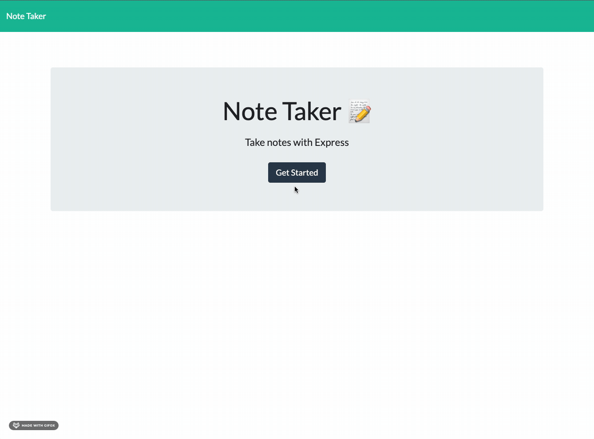
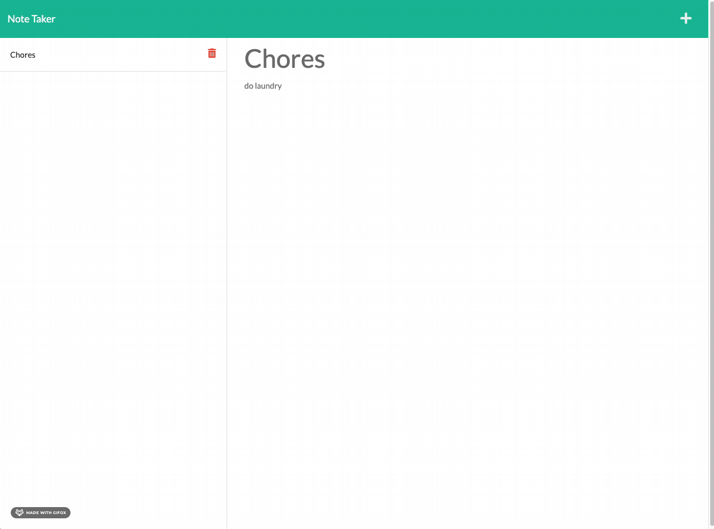
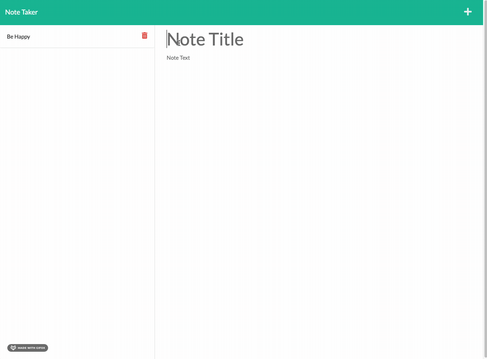
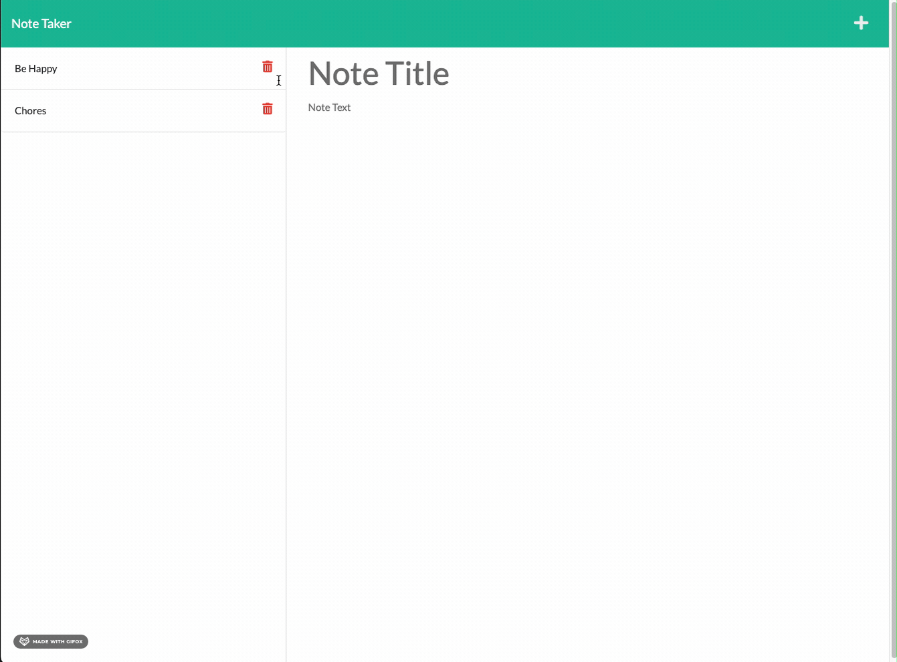

# Note-App  

# Table of Contents
1. [Goals](#goals)
2. [Implementation](#implementation)
3. [Usage](#usage)
4. [Credits](#credits)
5. [License](#license)

## Goals

Given a note-taking application, when the apllication is opened the a landing page with a link to a notes page is available. When a user clicks on the note page, then the user is  presented with a page with existing notes listed in the left-hand column, plus empty fields to enter a new note title and the note’s text in the right-hand column. 

Then, when a users enters a note with title and text, a save icon appears which, when clicked, saves the note. This note will appear on the left hand side. If the user clicks on a saved note on the left, then it will appear in the right column. However, when the user clicks on the write icon in the navigation bar then the right column becomes an empty field to enter a new note. 

## Implementation

To complete this project, I began by creating a route that would respond to the user with the note.html file when they clicked on the "Get Started" button on the Landing page. 

Then, I added a wild card route so that if a user entered anything other than the landing or notes pages, they woudld be redirected to the landing page. 

I then added several GET, POST, and DELETE routes to the server.js file to complete the Fetch calls already established in the index.js file. These routes allow the db.json file to be accessed and updated, depending on the users input. 

You can check out the deployed site [here](https://peaceful-river-60214.herokuapp.com/notes) and the repo [here](https://github.com/Traveye/note-app).

## Usage
NA

## Credits
All files in the public folder were provided as part of the project.

## License
MIT